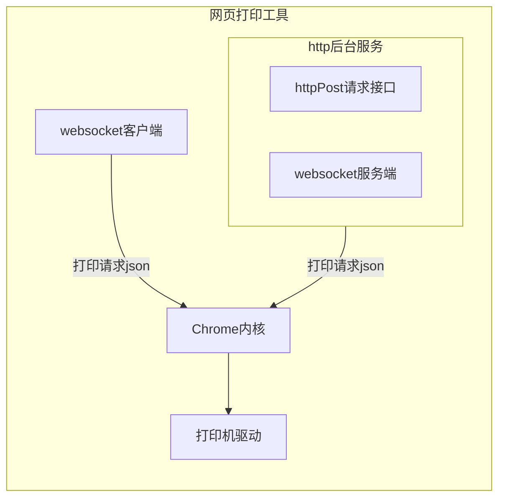

- [$1 使用](#1-使用)
  - [$1.1 接口注释](#11-接口注释)
    - [$1.1.1 获得 **网页打印工具**宿主电脑上的打印机和纸张信息](#111-获得-网页打印工具宿主电脑上的打印机和纸张信息)
    - [$1.1.2 添加一个打印机配置](#112-添加一个打印机配置)
    - [$1.1.3 获得打印机配置](#113-获得打印机配置)
    - [$1.1.4 删除一个打印机配置](#114-删除一个打印机配置)
    - [$1.1.5 更改一个打印机配置](#115-更改一个打印机配置)
    - [$1.1.6 发一个打印命令](#116-发一个打印命令)
    - [$1.1.7 获的打印过的页面](#117-获的打印过的页面)
    - [$1.1.8 设置远端websocket server url](#118-设置远端websocket-server-url)
    - [$1.1.9 获得远端websocket 地址](#119-获得远端websocket-地址)
  - [$1.2 httpPost请求方式](#12-httppost请求方式)
  - [$1.3 websocket 客户端方式](#13-websocket-客户端方式)
  - [$1.4 websocket 服务端方式](#14-websocket-服务端方式)
- [$2 作者和源码](#2-作者和源码)
- [$3 提供安装包的安装和卸载](#3-提供安装包的安装和卸载)
- [$4 另外。。。](#4-另外)


**网页打印工具** 它可以根据一个http请求或一段websocket信息，自动打印一个网页。你可以在网页的javascript中,通过window.print()来控制打印何时进行。它可以绕过浏览器的打印预览页面，实现自动打印。


核心功能部分、websocket客户端、及gui使用qt开发；http服务使用[drogon](https:drogon.org/); 一个可选的前端工具使用vue 和 [naive-ui](https:www.naiveui.com/)开发。
 

## $1 使用

1. 你应该确定，你想要打印什么页面，以及通过什么打印机打印
2. 在能访问到上述页面，并且能连接到上述打印机的电脑上安装 **网页打印工具**，（现在只在window系统中可用，所提供的发布程序是64位的）
3. 预先配置一组打印参数，打印参数包含：使用什么打印机，打印边距，打印方向等
4. 使用一个 http post 请求、一个websocket连接、或者让**网页打印工具**连接一个websocket服务器，来发送或接收一段信息告诉 **网页打印工具**去打印相关页面


### $1.1 接口注释

**网页打印工具**提供三种接口方式 httpPost、websocket 客户端和websocket服务端，它们信息的数据格式都是一致的。

#### $1.1.1 获得 **网页打印工具**宿主电脑上的打印机和纸张信息

*请求：*
```json
{
    "Id": "123",
    "MsgType": "GetPrintInfo"
}
```

*返回：*
```json
{
    "Id":"123",
    "IsSuccess": true,
    "Result": [
        {
            "Papers": [
                {
                    "Id": 0,
                    "Key": "Letter",
                    "PaperName": "\u4fe1\u7eb8",
                    "PaperSize": "215.9_279.4mm"
                },
            ],
            "PrinterName":"\u5bfc\u51fa\u4e3aWPS PDF"
        }

    
    ]

}

```

Id：由你来指定，用来标识一个请求。**网页打印工具**给你返回中将携带这个字段，它在websocket连接中有用，如果你不需要它，可以传**空字符串，不要传递其它类型参数或者忽视它**

MsgType:请求的类型，这里 `GetPrintInfo` 就是获得 **网页打印工具**宿主电脑上的打印机和纸张信息。

Result：你需要的信息一般在接口返回的这个字段里，在这个请求中:`PrinterName`,表示这个打印机的名称，`Papers`,这个打印机支持的纸张。


#### $1.1.2 添加一个打印机配置

根据 1.1.1 返回的信息,你应该配置一下打印机。

*请求：*
```json
{
    "Id": "AddOnePrintConfig",
    "MsgType": "AddOnePrintConfig",
    "Data": {
        "Name": "Hi",
        "PrinterName": "导出为WPS PDF",
        "TopMargin": 0,
        "BottomMargin": 1,
        "LeftMargin": 2,
        "RightMargin": 2,
        "Orientation": "横向",
        "PaperName": "A4"
    }
}
```

*返回：*
```json
{
    "Id":"AddOnePrintConfig",
    "IsSuccess":true,"Message":""
}
```
Id:再次说明，这个是你来指定的，它不需要和MsgType相同。

Data.Name:你指定的打印机配置的名称，它应该是唯一的

PrinterName:你在$1.1.1中获得的打印机名称

PaperName:你在 $1.1.1中获得的与打印机匹配的纸张名称

#### $1.1.3 获得打印机配置

当你配置了一个打印机，通过这个接口返回你的配置。

*请求：*
```json
{
    "Id": "GetPrintConfigs",
    "MsgType": "GetPrintConfigs"
}
```

*返回：*
```json
{
    "Id": "GetPrintConfigs",
    "IsSuccess": true,
    "Result": [
        {
            "BottomMargin": 0,
            "Id": 2,
            "LeftMargin": 0,
            "Name": "te",
            "Orientation": "A4",
            "PaperName": "A4",
            "PrinterName": "OneNote for Windows 10",
            "RightMargin": 0,
            "TopMargin": 0
        },
    ]
}
```

Result.Id:一个打印机配置的唯一标识。

#### $1.1.4 删除一个打印机配置

*请求：*
```json
{
    "Id": "DelOnePrintConfig",
    "MsgType": "DelOnePrintConfig",
    "Data": 1
},
```

*返回：*
```json
{"Id":"DelOnePrintConfig","IsSuccess":true,"Message":""}
```

Data：一个打印机配置的唯一标识

#### $1.1.5 更改一个打印机配置

*请求：*
```json
{
    "Id": "UpdateOnePrintConfig",
    "MsgType": "UpdateOnePrintConfig",
    "Data": {
        "Name": "test213",
        "PrinterName": "导出为WPS PDF",
        "TopMargin": 0,
        "BottomMargin": 1,
        "LeftMargin": 2,
        "RightMargin": 2,
        "Orientation": "横向",
        "PaperName": "A4"
    }
},
```

*返回：*
```json
{"Id":"DelOnePrintConfig","IsSuccess":true,"Message":""}
```

#### $1.1.6 发一个打印命令

*请求：*
```json
{
    "Id": "ToPrint",
    "MsgType": "ToPrint",
    "Data": [
        {
            "PageUrl": "https://www.bing.com",
            "ConfigName": "sdf",
            "PrintMode": "LoadAchieve"
        }
    ]
}
```

*返回：*
```json
{
"Id":"ToPrint",
"IsSuccess":true,
"Result":[{"IsSuccess":true,"Message":""}]
}

```

PageUrl：需要打印的网页 url。

ConfigName：一个打印机配置名称，你预先配置的。

PrintMode：它决定什么时候打印这个页面。它有两个可选值： LoadAchieve，当页面加载完成,开始打印；JsPrintRequest 当这个页面 调用 window.print() 时，开始打印。


#### $1.1.7 获的打印过的页面

*请求：*
```json
{
    "Id": "GetPrintedPages",
    "MsgType": "GetPrintedPages",
    "Data": {
        "Size": 20,
        "Page": 1
    }
}
```

*返回：*
```json
{
    "Id": "GetPrintedPages",
    "IsSuccess": true,
    "Result": {
        "Count": 1157,
        "Rows": [
            {
                "ConfigName": "test",
                "FromIp": "127.0.0.1",
                "FromType": "ServerWebsocket",
                "IsSuccess": true,
                "PageName": "https:/cn.bing.com",
                "PrintMode": "",
                "PrintTime": "2022-11-20 10:36:53.6500030"
            }
        ]
    }
}
```
#### $1.1.8 设置远端websocket server url

*请求：*
```json
{
    "Id": "InsertOrUpdateWebsocketUrl",
    "MsgType": "InsertOrUpdateWebsocketUrl",
    "Data": "ws:127.0.0.1:8001"
}
```

*返回：*
```json
{"Id":"InsertOrUpdateWebsocketUrl","IsSuccess":true}
```

#### $1.1.9 获得远端websocket 地址

*请求：*
```json
        {
            "Id": "GetWebsocketUrl",
            "MsgType": "GetWebsocketUrl"
        }
```

*返回：*
```json
{
    "Id": "GetWebsocketUrl",
    "IsSuccess": true,
    "Result": {
        "IsConnected": true,
        "WebSocUrl": "ws://127.0.0.1:8008"
    }
}
```

### $1.2 httpPost请求方式

如果你使用这个方式，请注意更私有的跨域策略，您可以参考[这里](https://wicg.github.io/private-network-access/)。推荐使用fetch方式。**网页打印工具**的http接口返回的head 中已包含：


```javascript
Access-Control-Allow-Origin:*
Access-Control-Allow-Methods: GET, POST
Access-Control-Allow-Private-Network: true
Access-Control-Allow-Credentials: true
```


你可以chrome内核浏览器中设置 chrome://flags/#block-insecure-private-network-requests 为disabled 来避免更私有的跨域策略，但不知道后续这个方法还是否有效。（看Google。。。）

一个http 请求的例子：

```javascript
const req = {
    Id: "",
    MsgType: "GetPrintInfo"
}
fetch("http://127.0.0.1:8847/PrintController/Print", {//Your webprinttool url
    method: "POST",
    body: JSON.stringify(req)//传递的数据
}).then(res => res.json()).then(data => {

    console.log(data)
})
```

### $1.3 websocket 客户端方式

你建立一个websocket客户端，连接 **网页打印工具**提供的websocket 服务Url ws://127.0.0.1:8847, 建议使用这个方式，它无跨地域的烦恼。

### $1.4 websocket 服务端方式

你建立一个websocket 服务，然后配置它的url到 **网页打印工具**。**网页打印工具**具备掉线重连功能。


## $2 作者和源码

1. 不入流的C++程序员，目前靠web搬砖吃饭。希望有一天能成为一个合格的C++程序员，但还有许多路要走（from 2022年11月）

2. [代码](https://github.com/ZhaoYouYa/webpage_printtool)，强烈欢迎建议和批评。

3. 真心希望这个能帮助到一些人。

## $3 提供安装包的安装和卸载

1. 安装包会自动安装在 C:\\Program Files\\PrintWebPage中，并添加一个注册表项在HKEY_CURRENT_USER\\Software\\Microsoft\\Windows\\CurrentVersion\\Run 中，名字是：PrintWebPage，用于开机启动。
2. 如果程序不能启动，你可以安装最新的vc++ 发布包试一下（这个电脑好久没升级了。。。）
3. 卸载的话，直接在目录里删除就可以了，注册表项在上述位置删除。
4. qt是支持跨平台的，这个在mac、或linux中应该也可以用，你可以自己编译，包含32位程序也是如此。

## $4 另外。。。

所有的配置都在根目录的 sqlite db中，你可以做任意的操作。这个程序可能会在不知不觉中控制你的打印机，请注意**安全问题**。
